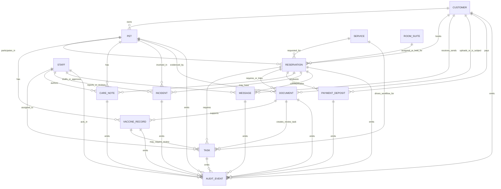

# Pet Resort canonical data model

This artifact is the canonical source-of-truth data model for the pet-resort agent foundation. It is intentionally a docs/schema artifact: it names the aggregate boundaries, lifecycle states, review gates, audit obligations, AI handling rules, and integration seams that future Rust contracts and adapters should implement without broad code refactors in this card.

## 1. Scope and source inputs

Scope:

- Define the canonical entities for customer, pet, reservation, service, room/suite, staff, operational task, documents, vaccines, care notes, incidents, messages, payments/deposits, and audit events.
- Preserve the current Rust domain direction: semantic module-owned types, invariant-bearing enums/builders/typestates when behavior depends on phase, and external-system/provider IDs quarantined at boundaries.
- Establish conservative human-approval and AI-output handling rules for medical, legal, safety, payment, and customer-facing outcomes.
- Provide enough schema shape for downstream implementation plans, tests, persistence design, and provider adapters.

Source inputs:

| Source | Contribution |
|---|---|
| Parent card `t_d13548b9` | Core entity catalog, ownership boundaries, relationship summary, lifecycle state inventory, cross-entity invariants, and open human gates. |
| Parent card `t_7890e7bc` | Pet profile schema, provenance, AI suggestion lifecycle, group-play eligibility boundary, append-only note/history policy, and pet verification gates. |
| Parent card `t_9be768e3` | Reservation schema and lifecycle, capacity/room/payment/special-care relationships, integration hooks, no-show/open-state questions, and Rust implementation deltas. |
| Parent card `t_a9088781` | Document and vaccine model, uploaded-file provenance, OCR/AI suggestion policy, verified vaccine semantics, eligibility gates, and audit evidence needs. |
| Parent card `t_03f4d420` | Operational task schema, task lifecycle, source-event dedupe, evidence model, assignment/escalation, and automation boundaries. |
| Parent card `t_0a8f9c6e` | Audit model/policy, immutable event shape, actor/source/subject modeling, before/after redaction, approval gates, outbound message chain of custody, and required audit events. |
| Repository docs/code | `docs/architecture/domain-contract-skeleton.md`, `docs/architecture/domain-quality-gate.md`, and current Rust modules under `domain/src` (`entities`, `pet`, `customer`, `care`, `temperament`, `reservation`, `payment`, `policy`, `workflow`). |

Non-goals for this artifact:

- No database migration is implied.
- No adapter is declared authoritative for all locations.
- No AI workflow may write canonical medical/safety/legal/payment/customer-facing facts without the review records specified below.

## 2. Entity catalog and ownership boundaries

| Entity | Owns / authoritative for | Does not own |
|---|---|---|
| `Customer` | Account/contact identity, household/contact preferences, portal/external customer refs, customer communication eligibility, customer-level document/payment/message links. | Pet medical facts, reservation lifecycle, payment-provider settlement truth, audit history. |
| `Pet` | Animal identity under a customer/household, stable profile facts, care/feeding/medication/behavior summaries, verification/readiness status, and links to longitudinal notes/documents/vaccine records. | Final vaccine compliance documents, reservation capacity, customer identity, incident resolution, payment state. |
| `Reservation` | Booking/service-delivery root tying customer, pet(s), service, location, dates/times, room/suite/capacity holds, deposits, hard stops, required reviews, tasks, care notes, messages, incidents, and audit events. | Customer profile truth, pet profile truth, service catalog truth, payment-provider ledger, source document storage. |
| `Service` | Offered service semantics: boarding, day play, day boarding, grooming, training, day spa, add-on eligibility, policy/rate/capacity overlays. | Location-specific room inventory, individual reservation state, payment transactions. |
| `Room/Suite` | Location-owned physical inventory and assignment/occupancy/cleaning/maintenance state. | Reservation lifecycle beyond assignment/holds, service catalog, customer/pet truth. |
| `Staff` | Human operator identity, roles, permissions, assignment, approval authority, and audit actor attribution. | Customer/pet/reservation data ownership, AI provenance, external provider identity. |
| `Task` | Operational workflow/review work item, assignment, due/escalation, related subject refs, source-event dedupe, completion evidence. | Canonical state changes for the subject entity it coordinates; those changes remain on the subject plus audit events. |
| `Document` | Uploaded/imported file metadata, immutable storage refs, provenance, scanning/OCR/extraction runs, document verification state, supersession, retention/legal hold. | Verified vaccine fact truth after review, pet profile truth, reservation approval. |
| `VaccineRecord` | Reviewed vaccine fact for a pet: vaccine name, dates, source document/provider evidence, status, policy context, reviewer decision/exception. | Raw file storage, customer account details, reservation status. |
| `CareNote` | Append-only operational care, feeding, medication, grooming, training, behavior, and handoff observations with internal/customer-safe projections. | Pet profile canonical facts until promoted/reviewed, incident investigation, customer message send status. |
| `Incident` | Safety/medical/behavior/liability event report, investigation/review workflow, evidence, customer communication approval, and closure/reopen state. | Routine care notes, payment decisions, source document storage. |
| `Message` | Customer/internal message draft, approval, queue/send/delivery/reply chain of custody and content projections. | Customer profile truth, reservation state, payment ledger, medical verification. |
| `Payment/Deposit` | Deposit/payment requirement, authorization/collection/manual reference, waiver/refund/credit exception workflow, and visible payment state snapshots. | Processor ledger/source of funds, service price catalog, reservation confirmation legality without reservation policy. |
| `AuditEvent` | Immutable append-only evidence of who/what/when/why for entity transitions, AI suggestions, approvals, tool calls, outbound messages, external sync, and redacted before/after summaries. | Mutable workflow state, raw secrets, full payment instruments, raw medical documents unless governed evidence storage references them. |

Boundary rules:

- Entity IDs should be semantic (`CustomerId`, `PetId`, `ReservationId`, etc.); provider IDs stay in external reference fields/adapters.
- Domain behavior must branch on explicit enums/policy values, not raw strings, booleans, or provider payloads.
- Supporting catalogs likely needed but not fully modeled here: `Location`, `Policy`, `CapacitySnapshot`, `CapacityHold`, `Rate/Price`, `Estimate`, and `ExternalSystemRef`.

## 3. ERD / relationship map

## 4. Core lifecycle state machines

### 4.1 Pet profile verification

States:

- `DraftIncomplete`: profile exists but required identity/care/ownership fields are missing.
- `UnverifiedOwnerReported`: owner/staff/imported facts are present but not reviewed for operational use.
- `StaffReviewed`: non-high-risk fields have staff review evidence.
- `EligibilityReviewRequired`: medical, vaccine, behavior, medication, playgroup, or unknown fields require review before service use.
- `ManagerApprovedException`: a manager-approved exception permits a constrained operational outcome.
- `ServiceRestricted`: profile can remain active but has restrictions such as no group play, individual care only, medical observation, or special handling.
- `ActiveVerified`: required facts for the relevant service are reviewed/current and no blocking hard stop remains.
- `ArchivedInactive`: pet is no longer active for future service.
- `SupersededDisputed`: prior facts remain in history but are replaced, disputed, or corrected.

Allowed transitions:

- Create/import -> `DraftIncomplete` or `UnverifiedOwnerReported`.
- Complete required fields -> `EligibilityReviewRequired` or `StaffReviewed` depending on risk.
- Review medical/behavior/playgroup facts -> `ActiveVerified`, `ServiceRestricted`, `ManagerApprovedException`, or `SupersededDisputed`.
- New document, incident, vaccine expiry, owner update, or care-note promotion -> back to `EligibilityReviewRequired` when it changes service eligibility.

Required audit:

- Actor, source, field paths, safe before/after summary, source document/note/message/task refs, review gate, approval id when applicable, and reason codes.

### 4.2 Reservation

States:

- `Inquiry`
- `Requested`
- `MissingInfo`
- `VaccinePending`
- `SpecialReview`
- `Waitlisted`
- `Offered`
- `Confirmed`
- `CheckedIn`
- `Active`
- `CheckedOut`
- `Cancelled`
- `Rejected`
- `NoShow` (open question: distinct state vs `Cancelled` with reason)

Guards:

- Confirmation requires no blocking hard stops, a valid capacity/room/resource hold, accepted estimate/offer, deposit policy satisfied or approved exception, verified/acceptable vaccine and medical information, and recorded approvals for exceptions.
- Check-in requires confirmed reservation, authorized dropoff, service readiness, current hard-stop check, and room/group/slot assignment ready.
- Checkout requires completed care, authorized pickup, final invoice/payment workflow complete or staff-routed, and required care/incident notes recorded.
- Cancel/no-show/reject must record reason, actor, customer communication state, capacity release, and payment/refund approval state.

AI boundary:

- AI may extract intake data, classify missing fields, draft offers/denials/messages, summarize evidence, create internal tasks, and suggest status transitions.
- AI may not confirm bookings, overbook, move waitlists by exception, deny/accept service exceptions, mutate payments, or send sensitive customer messages without review policy and approval record.

### 4.3 Document and vaccine verification

Document states:

- `Received`
- `QuarantinedRejected`
- `Extracting`
- `ExtractionFailed`
- `AwaitingReview`
- `Verified`
- `Rejected`
- `Superseded`
- `Archived`

Vaccine record states:

- `SuggestedExtracted`
- `PendingReview`
- `VerifiedCurrent`
- `VerifiedExpired`
- `Rejected`
- `ExceptionRequested`
- `ExceptionApproved`
- `Superseded`

Guards:

- Raw uploaded files must have immutable storage refs, hashes, source/actor/timestamp, virus scan status, and retention/legal-hold metadata before review.
- OCR/AI extraction can create suggested facts with spans/confidence/model/tool/prompt evidence but cannot create final compliance.
- Final vaccine/medical compliance requires licensed-source proof and human review in v1 unless a future trusted structured integration policy explicitly says otherwise.
- Ambiguous, unreadable, missing, conflicting, low-confidence, expired, not-yet-effective, or unaccepted-source records route to review/task, not automated eligibility.

### 4.4 Task

States:

- `DraftSuggestion`
- `Open`
- `Assigned`
- `InProgress`
- `Blocked`
- `NeedsManagerReview`
- `Completed`
- `Cancelled`
- `Superseded`

Guards:

- `DraftSuggestion` can only become operational when the automation policy allows task creation or a human/staff action accepts it.
- Completion requires configured evidence: note, photo/file, checklist, outbound message, external update, manager override, or system observation.
- Source-event dedupe prevents duplicate active tasks for the same location/workflow/provider object/source revision/task type/subject.
- Tasks coordinate work; canonical state changes are applied to subject entities only through their own validators and audit events.

### 4.5 Audit and approval

Approval request states:

- `DraftSuggested`
- `ApprovalRequested`
- `Approved`
- `Rejected`
- `ReturnedForChanges`
- `Applied`
- `Superseded`

Audit event states:

- Append-only `Recorded`; corrections are later events that reference the prior event.

Guards:

- AI agents may request approval but may not approve their own suggestions.
- Applying an approved change must reference approval id, suggestion id when present, source workflow event id, before/after state, policy snapshot, and actor.
- Redacted audit projections must omit secrets, raw payment instruments, webhook signatures, auth tokens, and credential material.

## 5. Field-level schema tables

Field conventions:

- `id` fields are semantic identifiers; external provider identifiers live in `external_refs` or provider-specific boundary DTOs.
- `created_at`, `updated_at`, and `version` are expected on mutable aggregates even when not repeated in every relationship note.
- `audit_refs` means references to immutable `AuditEvent` rows/events relevant to the transition or fact.

### 5.1 Customer

| Field | Type / vocabulary | Required | Ownership / notes |
|---|---|---:|---|
| `id` | `CustomerId` | yes | Canonical customer identity. |
| `location_ids` | `LocationId[]` | yes | Locations where customer has activity; avoid assuming one global location policy. |
| `full_name` | `customer::Name` | yes | Semantic validated name. |
| `email` | `customer::Email?` | no | At least one contact method required for most customer-facing workflows. |
| `mobile_phone` | `customer::Phone?` | no | SMS/voice consent must be represented separately when needed. |
| `preferred_contact` | `Email | Sms | Phone | Portal` | yes | Current Rust enum exists as `ContactChannel`. |
| `portal_accounts` | `ExternalCustomerRef[]` | no | Provider, external id, source, last synced. |
| `communication_status` | `Active | DoNotContact | Suppressed | PortalOnly` | yes | Required before outbound messaging. |
| `household_refs` | `CustomerId[]` or `HouseholdId?` | no | Open design for co-owners/households. |
| `profile_state` | `Prospect | Active | Incomplete | DoNotContact | Archived | MergedSuperseded` | yes | Merges require approval/audit. |
| `created_at/updated_at/version` | timestamps/int | yes | Optimistic concurrency. |
| `audit_refs` | `AuditEventId[]` | yes | Profile creation/update/merge/contact-consent events. |

### 5.2 Pet

| Field | Type / vocabulary | Required | Ownership / notes |
|---|---|---:|---|
| `id` | `PetId` | yes | Canonical animal identity. |
| `customer_id` | `CustomerId` | yes | Primary owner/account root. |
| `name` | `pet::Name` | yes | Semantic validated name. |
| `species` | `Dog | Cat | Other(label) | UnknownPendingReview` | yes | Unknown/other cannot silently pass service rules. |
| `breed` | descriptive value/source | no | Descriptive unless location policy requires breed review. |
| `birth_date` | date? | no | Drives age policy only with source/provenance. |
| `sex` | `Female | Male | Unknown` | no | Current Rust enum. |
| `spay_neuter_status` | `Spayed | Neutered | Intact | Unknown` | yes | Group play and cat rules may gate on this. |
| `weight` | value/unit/source/effective date | no | Needed for room/group/medication; classes are derived. |
| `size_class/weight_class/age_class` | derived enum | no | Derived, not manually authoritative. |
| `care_profile` | feeding/medications/allergies/conditions/contacts | yes | Medical/medication fields require review gates. |
| `temperament_profile` | group-play observation, people orientation, rating, flags, staff notes | yes | AI cannot clear concerning behavior. |
| `profile_state` | lifecycle above | yes | Operational readiness by service. |
| `verification_state` | field-level fact lifecycle | yes | `ProposedByAi`, `HumanEntered`, `Imported`, `StaffReviewed`, etc. |
| `source_refs` | docs/messages/forms/imports | yes | Provenance for canonical facts. |
| `audit_refs` | `AuditEventId[]` | yes | Profile/fact/review/exception events. |

### 5.3 Reservation

| Field | Type / vocabulary | Required | Ownership / notes |
|---|---|---:|---|
| `id` | `ReservationId` | yes | Booking/service-delivery root. |
| `location_id` | `LocationId` | yes | Policy/capacity/timezone scope. |
| `customer_id` | `CustomerId` | yes | Booking customer. |
| `pet_ids` | `PetId[]` | yes | Multi-pet strategy is open: one reservation with segments vs child reservations. |
| `primary_service` | `ServiceKind` | yes | Boarding/day play/day boarding/grooming/training/day spa. |
| `requested_add_ons` | `AddOn[]` | no | Add-ons may require independent capacity/resource holds. |
| `status` | reservation lifecycle enum | yes | Current Rust `ReservationStatus` lacks `NoShow`; see open questions. |
| `starts_at/ends_at` | timestamps | yes | Location timezone display; UTC persistence. |
| `requested/scheduled/actual_check_in_out` | windows/timestamps | no | Required for operational flow. |
| `source` | portal/website/phone/sms/email/staff/import | yes | Current Rust `ReservationSource`. |
| `external_refs` | provider refs | no | Gingr/PetSuites/NVA/manual imports. |
| `capacity_snapshot_id` | `CapacitySnapshotId?` | no | Evidence for availability decision. |
| `capacity_holds` | `CapacityHold[]` | no | Room/labor/group/groomer/trainer holds. |
| `room_assignments` | `RoomAssignment[]` | no | Physical inventory intervals. |
| `estimate_id/offer_id` | refs | no | Quote/hold expiration needs model decision. |
| `deposit_id/payment_refs` | refs | no | Payment/deposit entity owns detailed state. |
| `hard_stops` | `HardStop[]` | no | Missing vaccine, ineligible group play, medical review, deposit required, etc. |
| `required_reviews` | `ReviewGate[]` | no | Gates before status advancement. |
| `status_history` | transition records | yes | Actor, reason, source, approval refs. |
| `audit_refs` | `AuditEventId[]` | yes | All transitions/exceptions/customer-visible changes. |

### 5.4 Service

| Field | Type / vocabulary | Required | Ownership / notes |
|---|---|---:|---|
| `id` | `ServiceId` | yes | Catalog identity. |
| `kind` | `Boarding | DayPlay | DayBoarding | Grooming | Training | DaySpa` | yes | Current Rust `ServiceKind`. |
| `location_id` | `LocationId?` | no | Global kind vs location-specific offering is open. |
| `display_name` | string/newtype | yes | Customer/staff visible. |
| `status` | `Draft | Active | TemporarilyUnavailable | Retired` | yes | Catalog lifecycle. |
| `eligibility_policy_refs` | policy ids | yes | Vaccine, age, playgroup, care restrictions. |
| `capacity_model` | room/group/staff/calendar/resource | yes | Drives availability checks. |
| `default_add_ons` | add-on refs | no | Upsells/attachments. |
| `external_skus` | provider refs | no | Provider/catalog mapping. |
| `audit_refs` | `AuditEventId[]` | yes | Catalog changes. |

### 5.5 Room/Suite

| Field | Type / vocabulary | Required | Ownership / notes |
|---|---|---:|---|
| `id` | `RoomSuiteId` | yes | Physical inventory identity. |
| `location_id` | `LocationId` | yes | Inventory belongs to one location. |
| `type` | `Room | Suite | CatCondo | DayBoardingRoom | GroomingStation | TrainingRoom | Other(label)` | yes | Whether room/suite split is open. |
| `tier` | tier label/newtype | no | Pricing/customer-visible tier. |
| `capacity` | integer/semantic capacity | yes | Avoid raw count in policy code. |
| `compatible_species/services` | enums | yes | Prevent illegal assignments. |
| `status` | `Available | HeldReserved | Occupied | Cleaning | Maintenance | OutOfService | Retired` | yes | Assignment guard. |
| `current_reservation_id` | `ReservationId?` | no | Only for current projection; assignment history separate. |
| `maintenance_notes` | refs/text | no | Sensitive/internal. |
| `audit_refs` | `AuditEventId[]` | yes | Holds/assignment/status changes. |

### 5.6 Staff

| Field | Type / vocabulary | Required | Ownership / notes |
|---|---|---:|---|
| `id` | `StaffId` | yes | Human operator identity. |
| `location_ids` | `LocationId[]` | yes | Work scope. |
| `display_name` | string/newtype | yes | Staff UI. |
| `roles` | role enum set | yes | CSR, kennel tech, groomer, trainer, manager, admin, medical reviewer, etc. |
| `permissions` | permission enum set | yes | Approval and external-write authority. |
| `status` | `Invited | Active | Suspended | ArchivedTerminated` | yes | Actor eligibility. |
| `assignment_state` | shift/team metadata | no | Operational routing. |
| `external_refs` | workforce/provider refs | no | Adapter-owned IDs. |
| `audit_refs` | `AuditEventId[]` | yes | Role/permission/status changes. |

### 5.7 Task

| Field | Type / vocabulary | Required | Ownership / notes |
|---|---|---:|---|
| `id` | `TaskId` | yes | Operational work item. |
| `location_id` | `LocationId` | yes | Routing/SLA scope. |
| `type` | task type enum | yes | Review, follow-up, care, incident, message approval, external update, etc. |
| `title/body` | `workflow::task::Title/Body` | yes | Current workflow semantic newtypes exist. |
| `status` | task lifecycle enum | yes | Includes draft suggestion and superseded. |
| `priority` | enum/value | yes | Conservative defaults from source/risk/SLA. |
| `assignment` | staff/team/role | no | Assigned can be status or orthogonal field; open. |
| `due_at/sla` | timestamp/policy ref | no | Escalation basis. |
| `related_entities` | typed refs | yes | Subject(s) task coordinates. |
| `source` | workflow/provider/import/source event refs | yes | Dedupe and provenance. |
| `automation_level` | `AutomationLevel` | yes | Draft/internal/safe/approval/never. |
| `required_review_gates` | `ReviewGate[]` | no | Gates before completion/apply. |
| `evidence_requirements` | evidence enum set | no | Completion policy. |
| `completion_evidence` | evidence refs | no | Required to complete unless manager override. |
| `blocked_reason/escalation` | values | no | Operational routing. |
| `audit_refs` | `AuditEventId[]` | yes | Lifecycle/evidence/assignment events. |

### 5.8 Document

| Field | Type / vocabulary | Required | Ownership / notes |
|---|---|---:|---|
| `id` | `DocumentId` | yes | Immutable logical document record. |
| `subject_type` | customer/pet/reservation/etc. | yes | Primary subject. |
| `customer_id/pet_id/reservation_id` | refs | conditional | Based on subject/use. |
| `location_id` | `LocationId` | yes | Policy/retention scope. |
| `expected_content` | vaccine/waiver/photo/medical/etc. | no | Intake hint. |
| `classification` | document class enum | yes | Human/AI-reviewed classification. |
| `source` | upload/message/import/provider/manual | yes | Provenance. |
| `uploaded_by_actor` | `ActorRef` | yes | Customer/staff/system/integration. |
| `uploaded_at/received_channel/source_event_id` | timestamp/channel/ref | yes | Chain of custody. |
| `original_filename/mime/file_size` | metadata | yes | Safe file metadata. |
| `content_hash_sha256` | hash | yes | Integrity. |
| `storage_ref` | bucket/key/version/provider | yes | Raw object location; never inline raw file. |
| `virus_scan_status` | enum | yes | Must pass before use. |
| `pii_redaction_status` | enum | yes | Projection readiness. |
| `derived_artifact_refs` | preview/redacted/OCR refs | no | Derived objects are versioned. |
| `extraction_runs` | extraction run refs | no | OCR/AI provenance. |
| `verification_status` | document lifecycle enum | yes | Review/supersession state. |
| `review_gate/reviewer/review_decision` | review fields | conditional | Required for final verification. |
| `supersedes/superseded_by` | `DocumentId?` | no | Preserve old evidence. |
| `retention/legal_hold/deletion` | policy fields | yes | Compliance. |
| `audit_refs` | `AuditEventId[]` | yes | Upload/scan/extract/review/supersede. |

### 5.9 VaccineRecord

| Field | Type / vocabulary | Required | Ownership / notes |
|---|---|---:|---|
| `id` | `VaccineRecordId` | yes | Reviewed or suggested vaccine fact. |
| `pet_id` | `PetId` | yes | Animal subject. |
| `location_id` | `LocationId` | yes | Policy context. |
| `vaccine_name` | `policy::VaccineName` / controlled vocabulary | yes | Dog defaults: Rabies, DHPP, Bordetella, Canine Influenza; cat defaults: Rabies, FVRCP. |
| `administered_at` | date? | no | May be absent on proof docs. |
| `expires_at` | date? | conditional | Required for current compliance unless policy exception. |
| `effective_at` | date? | no | Waiting-period policy. |
| `source_document_id` | `DocumentId` | yes | Evidence document. |
| `source_provider` | vet/clinic/provider refs | conditional | Licensed vet proof in v1. |
| `source_acceptance` | accepted/rejected/unknown | yes | Location policy context. |
| `raw_values` | redacted extraction fields | no | Evidence, not canonical behavior input. |
| `normalized_values` | typed dates/name/source | yes | Reviewed values. |
| `suggestion_id/extraction_run_id` | refs | no | AI/OCR provenance. |
| `confidence` | numeric + component scores | no | Routes review; does not approve. |
| `status` | vaccine lifecycle enum | yes | Suggested/pending/verified/rejected/exception/superseded. |
| `eligibility_result` | service/date/location gate | no | Derived from policy snapshot. |
| `reviewer_actor/reviewed_at/reason` | approval fields | conditional | Required for verified/rejected/exception. |
| `policy_snapshot_id` | policy ref | yes | Reproducible decision. |
| `audit_refs` | `AuditEventId[]` | yes | Suggest/review/exception/eligibility events. |

### 5.10 CareNote

| Field | Type / vocabulary | Required | Ownership / notes |
|---|---|---:|---|
| `id` | `CareNoteId` | yes | Append-only note record. |
| `pet_id` | `PetId` | yes | Animal subject. |
| `reservation_id` | `ReservationId?` | no | Service-specific note context. |
| `location_id` | `LocationId` | yes | Operational scope. |
| `author_actor` | `ActorRef` | yes | Staff/system/customer/import source. |
| `note_type` | feeding/medication/behavior/grooming/training/handoff/general | yes | Drives review/sensitivity. |
| `internal_text` | redacted/sensitive text ref/value | yes | Sensitive internal projection. |
| `customer_safe_summary` | text? | no | Requires review before customer use. |
| `source_refs` | docs/messages/tasks/imports | no | Provenance. |
| `review_state` | `Draft | NeedsStaffReview | NeedsManagerReview | ApprovedForOperations | ApprovedForCustomerSummary | Rejected | Superseded | Disputed` | yes | From pet-profile handoff. |
| `supersedes/disputes` | note refs | no | No destructive overwrites. |
| `promoted_profile_fields` | field refs | no | If note becomes profile fact. |
| `audit_refs` | `AuditEventId[]` | yes | Create/review/supersede/publish. |

### 5.11 Incident

| Field | Type / vocabulary | Required | Ownership / notes |
|---|---|---:|---|
| `id` | `IncidentId` | yes | Safety/liability event root. |
| `location_id` | `LocationId` | yes | Policy/reporting scope. |
| `pet_ids/customer_ids/reservation_id` | refs | yes | Involved subjects. |
| `reported_by_actor` | `ActorRef` | yes | Reporter. |
| `occurred_at/reported_at` | timestamps | yes | Timeline. |
| `incident_type` | medical/behavior/injury/property/customer/staff/other | yes | Drives gates. |
| `severity` | low/medium/high/critical | yes | Escalation. |
| `description_internal` | sensitive text | yes | Not customer-safe by default. |
| `evidence_refs` | docs/photos/care notes/messages | no | Chain of custody. |
| `status` | `DraftReported | NeedsManagerReview | Investigating | CustomerCommunicationDrafted | ApprovedForSend | Resolved | Closed | Reopened` | yes | Customer communication has its own gate. |
| `required_reviews` | `ReviewGate[]` | yes | Safety/legal/medical/message gates. |
| `customer_message_id` | `MessageId?` | no | Draft/approved send chain. |
| `resolution_summary` | internal/customer-safe variants | no | Approval required for customer-safe variant. |
| `audit_refs` | `AuditEventId[]` | yes | Report/review/communication/closure/reopen. |

### 5.12 Message

| Field | Type / vocabulary | Required | Ownership / notes |
|---|---|---:|---|
| `id` | `MessageId` | yes | Communication root. |
| `location_id` | `LocationId` | yes | Sender policy/suppression scope. |
| `customer_id` | `CustomerId` | conditional | Customer-facing messages. |
| `reservation_id/pet_id/task_id/incident_id` | refs | no | Context links. |
| `direction` | inbound/outbound/internal | yes | Chain of custody. |
| `channel` | email/sms/phone/portal/other | yes | Current workflow has message channel newtype. |
| `content_kind` | reminder/approval/request/info/incident/payment/etc. | yes | Determines gate. |
| `draft_body` | text | conditional | Draft before approval/send. |
| `approved_body` | text? | conditional | Required for send when gate applies. |
| `status` | `Draft | NeedsReview | Approved | Queued | Sent | Delivered | Failed | Received | SuppressedCancelled` | yes | Outbound lifecycle. |
| `ai_suggestion_id` | ref? | no | If AI drafted. |
| `approval_id/approved_by/approved_at` | fields | conditional | Required for sensitive sends. |
| `external_message_refs` | provider ids | no | Adapter state. |
| `delivery_events` | attempt/delivered/bounced/replied | no | Immutable-ish event log. |
| `audit_refs` | `AuditEventId[]` | yes | Draft/edit/approval/send/delivery/reply. |

### 5.13 Payment/Deposit

| Field | Type / vocabulary | Required | Ownership / notes |
|---|---|---:|---|
| `id` | `PaymentDepositId` | yes | Payment/deposit workflow root. |
| `reservation_id` | `ReservationId` | conditional | Most deposits are reservation-scoped. |
| `customer_id` | `CustomerId` | yes | Payer/account. |
| `location_id` | `LocationId` | yes | Policy scope. |
| `kind` | deposit/payment/refund/credit/waiver | yes | Determines approval gates. |
| `amount` | `money::Money` | conditional | Required for monetary operations. |
| `refundable_until` | timestamp? | no | Current `Deposit` supports this. |
| `status` | `NotRequired | Required | Pending | Authorized | Paid | Failed | Waived | Refunded | PartiallyRefunded | Cancelled` | yes | Current Rust has subset: not required/required/paid/refunded/failed/waived by manager. |
| `payment_reference` | `payment::PaymentReference?` | no | Manual/provider reference. |
| `provider_refs` | external refs | no | Live processor state stays boundary-owned. |
| `policy_snapshot_id` | policy ref | yes | Deposit/refund/waiver rules. |
| `exception_request` | reason/reviewer | no | Waivers/refunds/credits require approval. |
| `approval_id` | ref? | conditional | Required for exceptions/live mutation. |
| `audit_refs` | `AuditEventId[]` | yes | Requirement/collection/failure/waiver/refund. |

### 5.14 AuditEvent

| Field | Type / vocabulary | Required | Ownership / notes |
|---|---|---:|---|
| `id` | `AuditEventId` | yes | Append-only event id. |
| `occurred_at` | timestamp | yes | When action occurred. |
| `recorded_at` | timestamp | yes | When logged. |
| `actor` | customer/staff/manager/system/AI agent/external integration | yes | Current `ActorRef` lacks explicit external integration variant; open debt. |
| `subject` | typed subject ref | yes | Customer, pet, reservation, location, workflow, external, plus future entity subjects. |
| `source` | workflow/tool/provider/request/task/message/doc refs | yes | Chain of custody. |
| `taxonomy` | entity lifecycle/workflow-AI/messaging/external/security-compliance | yes | Search/reporting. |
| `action` | typed action enum/extension | yes | Promote extension labels when behavior branches. |
| `before_summary/after_summary` | redacted values | conditional | Field paths + change kind + hashes/tokens/safe summaries for sensitive data. |
| `ai_suggestion` | suggestion id/model/prompt/tool/provenance | no | Required when AI produced recommendation/draft/extraction. |
| `approval` | approval id/gate/reviewer/decision | conditional | Required for gated changes. |
| `outbound_message` | message chain refs | no | Draft/edit/approval/send evidence. |
| `evidence_refs` | docs/files/tasks/external payload hashes | no | Never raw secrets/payment instruments. |
| `redaction_policy` | classification/policy version | yes | Determines projections. |
| `integrity` | payload hash/signature/sequence | recommended | Supports replay/tamper checks. |

## 6. Human approval gates and required audit policy

Required review gates:

| Gate | Required for | Minimum audit payload |
|---|---|---|
| `MedicalDocumentReview` | Vaccine/medical final approval, medication instructions, medical exceptions, ambiguous/expired/missing records, source exceptions. | Source document/version/hash, extracted values/spans/confidence, policy snapshot, reviewer actor/role, decision, before/after eligibility, reason codes. |
| `BehaviorReview` | Group-play eligibility, bite/aggression/anxiety/escape/resource-guarding flags, incident-driven restrictions, temperament clearance. | Evidence notes/incidents, prior eligibility, new decision, reviewer, restrictions, customer-safe summary status. |
| `ManagerApproval` | Booking/capacity exceptions, overbooking, waitlist movement exceptions, service acceptance/denial exceptions, profile merge, incident closure exceptions, destructive/superseding changes. | Requesting actor, manager actor, source workflow/task, risk summary, before/after state, rationale. |
| `RefundOrDepositException` | Waivers, refunds, credits, fee exceptions, deposit policy overrides, direct payment mutation when supported. | Amount, policy snapshot, payment refs, customer/reservation refs, approver, reason, external tool/provider result or manual reference. |
| `CustomerMessageApproval` | Sensitive outbound customer messages: medical/safety/legal/payment/service denial, incident updates, high-risk AI-drafted language, non-templated external sends. | Draft body hash/safe content ref, editor history, approver, approved body/version, queue/send/delivery events, suppression/consent state. |

Required audit policy:

- Audit is append-only; corrections and reversals are later events referencing earlier events.
- Every lifecycle transition, approval request/decision/application, AI suggestion, external-system write/read used for decisioning, outbound message event, and manager override emits an `AuditEvent`.
- Applying an approval must link: subject entity, approval id, suggestion id when present, task/workflow/source event id, before/after summaries, policy snapshot, and actor.
- Before/after values for sensitive data store field paths, change kinds, hashes/tokens, and safe summaries; raw values belong only in governed evidence stores.
- Never store raw secrets, full payment instruments, auth tokens, webhook signatures, or credential material in audit metadata.

## 7. AI output handling

AI output categories:

| AI output | Canonical handling |
|---|---|
| OCR/extracted document facts | `Suggested*` records with source spans, confidence, model/tool/prompt/run ids; never final compliance until review. |
| Pet/profile fact extraction | `ProposedByAi` field facts with provenance; cannot clear restrictions or activate medical/safety/playgroup eligibility without gate. |
| Reservation triage/status | Suggested status/action plus risk flags and missing-info classification; deterministic Rust validators and gates decide applicability. |
| Operational tasks | May create internal tasks only when policy allows `InternalTaskOnly`/`SafeToAutomate`, source dedupe passes, and no gated canonical change is applied. |
| Customer messages | Draft only by default; sensitive/customer-facing sends require approval and chain-of-custody audit. |
| Payments/deposits | Draft/recommend/request approval only; live charge/capture/refund/waiver requires explicit payment policy and approval record. |
| Incident/care summaries | Draft/suggest summaries; customer-safe projection and incident closure require appropriate review. |

Required provenance fields for AI outputs:

- `suggestion_id`, `workflow_event_id`, `model/provider/version`, `tool/function`, `prompt/template/version`, `input source refs`, `source spans` where applicable, `confidence/component scores`, `risk flags`, `policy snapshot`, `created_by_actor = Agent`, `created_at`, `review_gate`, `approval_id` when applied, and final decision/reason.

Invariant:

- AI output is a suggestion/draft until verified. The absence of a review gate is not itself approval; a typed `AutomationLevel`/policy decision must authorize any automated application.

## 8. Integration notes for Rust domain contracts and external systems

Rust domain contract implications:

- Preserve the module-owned semantic style already present in `domain/src`: `customer`, `pet`, `care`, `temperament`, `reservation`, `payment`, `policy`, and `workflow` own validated values; `entities` composes aggregates.
- Introduce new modules only when behavior needs ownership: likely `document`, `vaccine`, `task`, `message`, `incident`, `audit`, `staff`, `service`, `room`, and `capacity` as implementation slices evolve.
- Keep provider payloads out of core behavior. Use boundary DTOs/adapters for Gingr/PetSuites/NVA/manual imports and convert to semantic values before policy/workflow logic.
- Prefer explicit enums over booleans for lifecycle, source acceptance, review state, message delivery state, payment exception state, and eligibility outcomes.
- Use `bon` builders for aggregate construction where many fields are required/optional; use `statum` only where method legality changes by lifecycle phase, such as reservation request -> offer -> confirm -> check-in -> active -> checkout.
- Extend `policy::ReviewGate`/`AutomationLevel` deliberately. If a new gate or automated action appears, add semantic tests before implementation.
- Current Rust gaps to address in future cards: distinct external-integration actor, richer audit schema, document/vaccine entities, task entity, message entity, payment status breadth, room/capacity inventory contracts, and reservation no-show semantics.

External reservation/customer/document systems:

- Gingr/PetSuites/NVA/provider IDs belong in `external_refs` with provider, external id, source revision, sync timestamps, and payload hashes.
- External provider events should map into `WorkflowEvent`/task/source-event dedupe keys before creating tasks or suggestions.
- Provider availability/reservation/payment/message writes should be mediated by capability-specific ports: availability read, reservation draft/update, customer/profile read, document intake, messaging draft/send, payment authorization/reference, and audit sink.
- External writes that affect customers, payments, safety, legal, booking exceptions, or medical/vaccine eligibility require typed policy decisions and approval references unless explicitly pre-approved as low-risk automation.
- Document storage should preserve immutable originals plus versioned redacted/OCR/preview artifacts. Raw documents are evidence; canonical vaccine facts live in reviewed `VaccineRecord` rows.

## 9. Open questions and assumptions

Assumptions:

- V1 vaccine/medical compliance is human-reviewed even if OCR confidence is high.
- AI may draft/extract/summarize/classify/create internal low-risk tasks, but cannot independently apply high-risk canonical changes.
- Boarding capacity needs overnight physical room/suite/cat-condo inventory; day play and day boarding have different group/private capacity semantics.
- Customer-safe projections of care notes/incidents/messages are distinct from internal text.
- Audit is append-only and should be useful for replay, compliance review, and approval chain inspection.

Open questions:

1. Should `NoShow` be a distinct `ReservationStatus`, or `Cancelled` with `CancellationReason::NoShow`?
2. Should `Offered` own hold expiration and quote acceptance, or should offer/estimate be a separate entity?
3. Should multi-pet bookings be one reservation with per-pet segments or linked child reservations?
4. Should `Room` and `Suite` be one polymorphic inventory entity or separate subtypes?
5. What minimum v1 payment boundary is intended: manual references, generated payment links, or direct gateway operations behind approval gates?
6. Which low-risk templated customer messages, if any, can be auto-sent after location-policy approval?
7. Can future trusted vet/EHR integrations bypass manual vaccine review, or does all v1 compliance remain human-reviewed?
8. What exact freshness windows apply for vaccines, temperament/playgroup assessments, care restrictions, and service-specific readiness?
9. Which staff roles can approve playgroup eligibility, medication double-checks, medical-document reviews, manager exceptions, refunds/deposit waivers, and customer messages?
10. Do local policies require breed-restriction fields, or should breed stay descriptive until a specific policy requires review?
11. Should emergency/veterinarian contacts live on pet care profile or customer/contact profile with pet-specific references?
12. What document/care-note/incident/audit retention, redaction, and legal-hold durations apply by jurisdiction/location?
13. Should `ActorRef` grow an explicit `ExternalIntegration` variant now, or only when external actor permissions/search need behavior?
14. Should location, policy, price/rate, capacity snapshot/hold, estimate/offer, and household become first-class entities in the canonical catalog?
15. What provider-specific external update evidence is required for Gingr/PetSuites/NVA integrations versus manual workflows?
