# Entity atlas relationship map

Purpose: this relationship page turns the entity-family atlas drafts into one operating-model map. It is written for a non-coder reviewer who wants to know how a resort fact moves from provider/source evidence into a safe workflow packet, what an agent may draft, who reviews it, and how the result becomes measurable outcome or storage evidence.

This page consumes these family pages:

- [Entity atlas inventory](entity-atlas-inventory.md)
- [Workflow-to-entity navigation map](workflow-to-entity-navigation-map.md)
- [Workflow packets, agents, drafts, and review queues](entity-atlas-workflow-packets-agents.md)
- [PetSuites core entity atlas](entity-atlas-petsuites-core-entities.md)
- [Revenue opportunity entity families](entity-atlas-revenue-opportunity-entities.md)
- [Source, provenance, and data-quality atlas](source-provenance-data-quality-atlas.md)
- [Review gates, blocked actions, and human approval boundaries](entity-atlas-review-safety-boundaries.md)
- [Outcome, labor, operations, analytics, money, and safety evidence atlas](entity-atlas-outcomes-operations-money.md)
- [Runtime, storage, API, worker, CLI, and contract-test surfaces](entity-atlas-runtime-storage-api-surfaces.md)
- [Gingr provider boundary atlas](../integrations/gingr/provider-boundary-atlas.md)

## How to read this map

The root README says every public entity should answer what it is, why it exists, where it is used, what it relates to, who is authoritative, what automation may do, what is blocked, how value is measured, and where proof lives. This page answers the relationship parts of those questions.

Rules used in every table below:

- Source facts are evidence, not automatic approval.
- `domain` entities are the semantic pet-resort vocabulary.
- `app` packets are review bundles, drafts, queue items, and outcome-capture workflows.
- `storage` records are persisted proof/projections, not business decision makers.
- `apps/api`, `apps/worker`, and `apps/cli` are runtime shells over app/domain contracts.
- Edges with a source contract are backed by a path, module, test, or family atlas page.
- Edges marked `docs-only conceptual / TODO` are useful explanatory links that need a future contract before they can be treated as implementation-backed.

## Readable operating-model diagram

```mermaid
flowchart LR
    A[Gingr/API/webhook, staff notes, import files] -->|source evidence only; domain/src/source.rs; integrations/gingr/src/*| B[Source refs, provenance, raw payload refs]
    B -->|mapping or data-quality gate; integrations/gingr/src/mapping/*; domain/src/data_quality.rs| C[Domain entities and service-line truths]
    C -->|app request + deterministic checks; app/src/* workflow modules| D[Workflow packet / review queue]
    D -->|agent prompt packet may summarize/rank/draft only; app/src/agents.rs| E[Agent draft, internal task draft, audit-event draft]
    E -->|review gate / blocked-action boundary; domain/src/policy.rs; domain/src/workflow.rs| F[Human role approves, rejects, fixes, or escalates]
    F -->|reviewed disposition; app outcome record contracts| G[Outcome record + labor minutes]
    G -->|projection/codec/storage proof; storage/src/operations.rs| H[Storage record, reporting evidence, audit trail]
    H -->|contract tests and runtime shells expose proof safely; apps/api/tests/*; apps/worker/src/runtime.rs| I[API/worker/CLI inspection]

    D -. no direct authority .-> X[Blocked: customer sends, provider/PMS writes, schedule/capacity changes, payment movement, safety approvals]
    E -. no direct authority .-> X
```

Non-coder summary: automation lives in the middle. It can organize evidence, prepare drafts, rank queues, and capture outcomes. It cannot directly send customer messages, write Gingr/PMS records, change schedules or capacity, move money, or approve safety/medical/policy exceptions.

## Primary edge table: source fact -> packet -> draft -> review -> outcome/storage

| From | Edge | To | Source contract backing the edge | Human/safety note |
| --- | --- | --- | --- | --- |
| Gingr endpoint, response, DTO, or webhook payload | becomes source evidence only after request/response/webhook validation | Source refs, provenance, raw payload refs, provider records | [Gingr provider boundary atlas](../integrations/gingr/provider-boundary-atlas.md), `integrations/gingr/src/endpoint/*`, `integrations/gingr/src/response.rs`, `integrations/gingr/src/webhook.rs`, `domain/src/source.rs` | Provider ids/statuses are not domain ids or approvals. |
| Staff notes, staff handoffs, documents, care facts, import files | become evidence with role/source context | Source facts and document/audit evidence | [Source, provenance, and data-quality atlas](source-provenance-data-quality-atlas.md), `domain/src/source.rs`, `domain/src/document.rs`, `domain/src/audit.rs`, `app/src/checkout_completion.rs`, `app/src/daily_update.rs` | Sensitive or ambiguous facts route to review before customer-facing use. |
| Source refs and provider records | map or fail explicitly | Domain candidate/entity or data-quality issue | [Gingr provider boundary atlas](../integrations/gingr/provider-boundary-atlas.md), `integrations/gingr/src/mapping/*`, `domain/src/data_quality.rs`, `domain/src/entities.rs` | Missing/invalid provider fields become mapping errors or hygiene candidates, not silent defaults. |
| Domain entity, source refs, and policy context | compose an app request | Workflow packet/review queue | [Workflow packets atlas](entity-atlas-workflow-packets-agents.md), `app/src/booking_triage.rs`, `app/src/data_quality_hygiene.rs`, `app/src/checkout_completion.rs`, `app/src/crm_retention.rs`, `app/src/daily_update.rs`, `app/src/manager_daily_brief.rs` | App workflow owns the review bundle, not live PMS/customer/payment authority. |
| Workflow packet | may be summarized/ranked/drafted | Agent prompt packet, customer-message draft, internal task draft, audit-event draft | `app/src/agents.rs`, `domain/src/agent.rs`, `domain/src/workflow.rs`, family page [workflow packets](entity-atlas-workflow-packets-agents.md) | Agent output is draft-only unless a separate reviewed contract says otherwise. |
| Draft, recommended action, or blocked action | is held at a review gate | Human role decision: front desk lead, manager, care/medical reviewer, approved sender, regional ops, integration owner | [Review gates atlas](entity-atlas-review-safety-boundaries.md), `domain/src/policy.rs`, `domain/src/workflow.rs`, workflow-local `BlockedAction` / `SafeAgentAction` contracts | Human role changes by fact family: safety, payment, customer messaging, data hygiene, or source integration. |
| Human decision / reviewed outcome | is recorded | Outcome record, audit event, approval record, actual labor minutes | [Outcome/labor atlas](entity-atlas-outcomes-operations-money.md), `domain/src/entities.rs`, `domain/src/audit.rs`, `app/src/*::OutcomeRecord`, `storage/src/operations.rs` | Labor savings are claims only after reviewed outcome evidence exists. |
| Outcome record and source refs | are persisted/projected | Storage records, reporting evidence, API/local proof | [Runtime/storage/API atlas](entity-atlas-runtime-storage-api-surfaces.md), `storage/src/operations.rs`, storage tests, API tests | Storage proves what was reviewed and measured; it does not authorize future live actions. |

## Gingr DTO -> mapping -> domain entity -> app workflow

| From | Edge | To | Source contract backing the edge | Follow-up status |
| --- | --- | --- | --- | --- |
| `gingr::response::{OwnerRecord, AnimalRecord, ReservationRecord, ReferenceRecord}` | provider-shaped record is quarantined as source evidence | Source ref / provenance / provider record | [Gingr provider boundary atlas](../integrations/gingr/provider-boundary-atlas.md), `integrations/gingr/src/response.rs`, `domain/src/source.rs` | Backed by docs/source; provider fields remain provider evidence. |
| `gingr::dto::retail::Item` | maps through retail mapper | `gingr::mapping::retail::ProductCandidate` then retail/product review candidate | [Gingr provider boundary atlas](../integrations/gingr/provider-boundary-atlas.md), [Revenue opportunity entities](entity-atlas-revenue-opportunity-entities.md), `integrations/gingr/src/dto/retail.rs`, `integrations/gingr/src/mapping/retail.rs`, `domain/src/retail/product.rs` | Backed for retail; candidate still needs review before product/store action. |
| Owner fields | map through customer mapper | Customer contact candidate / `domain::entities::Customer` context | `integrations/gingr/src/mapping/customer.rs`, `domain/src/customer.rs`, `domain/src/entities.rs`, [PetSuites core entities](entity-atlas-petsuites-core-entities.md) | Backed for candidate mapping; outreach permission remains separate. |
| Animal fields | map through pet mapper | Pet name/profile candidate / `domain::entities::Pet` context | `integrations/gingr/src/mapping/pet.rs`, `domain/src/pet.rs`, `domain/src/entities.rs`, [PetSuites core entities](entity-atlas-petsuites-core-entities.md) | Backed for candidate mapping; care/temperament/vaccine approval remains human-reviewed. |
| Reservation endpoint/read model | supplies source reservation evidence | `domain::source::reservation::Snapshot` and reservation workflow inputs | `integrations/gingr/src/endpoint/reservations.rs`, `domain/src/source.rs`, `domain/src/entities.rs`, `app/src/booking_triage.rs`, `app/src/checkout_completion.rs` | Backed; no check-in/out or confirmation write authority. |
| Provider surface gap marker | records unsupported or undocumented provider surface | Data-quality issue or TODO mapping gap | `integrations/gingr/src/dto/mod.rs`, [Gingr provider boundary atlas](../integrations/gingr/provider-boundary-atlas.md), [Source/provenance atlas](source-provenance-data-quality-atlas.md) | Explicitly docs/source-backed as a gap; no inferred DTO semantics. |
| Verified webhook envelope | may become source event evidence | Future workflow event candidate | `integrations/gingr/src/webhook.rs`, `integrations/gingr/tests/webhook_contracts.rs`, [Gingr provider boundary atlas](../integrations/gingr/provider-boundary-atlas.md) | Backed for verification; downstream workflow mapping is partly future work unless linked by a workflow contract. |

## Service-line entities -> workflow pages

For the inverse workflow-first entrypoint, use [Workflow-to-entity navigation map](workflow-to-entity-navigation-map.md). It starts from booking/triage, data hygiene, checkout/folio, grooming/daycare/boarding operations, daily updates/Pawgress, manager review, and regional exceptions, then lands back on the entity families below.

| Service-line or core entity | Feeds these workflow pages | Edge source | What automation may do | What remains blocked/reviewed |
| --- | --- | --- | --- | --- |
| Reservation and reservation status | [Booking Triage](../workflows/operator/booking-triage.md), [Checkout Completion](../workflows/operator/checkout-completion.md), [Daily Updates](../workflows/operator/daily-updates-pawgress-drafts.md), [Grooming Rebooking / Retention](../workflows/operator/grooming-rebooking-retention.md) | [PetSuites core entities](entity-atlas-petsuites-core-entities.md), `domain/src/reservation/mod.rs`, `domain/src/entities.rs`, `app/src/booking_triage.rs`, `app/src/checkout_completion.rs` | Draft readiness/checkout evidence summaries and internal task drafts. | No booking confirmation/rejection, PMS status write, check-in/out, schedule/capacity mutation. |
| Customer and contact channel | Booking Triage, Daily Updates, Retention, Data Quality Hygiene | [PetSuites core entities](entity-atlas-petsuites-core-entities.md), `domain/src/customer.rs`, `domain/src/entities.rs`, `app/src/crm_retention.rs`, `app/src/daily_update.rs` | Draft customer-safe scripts or message drafts for approved sender review. | No autonomous customer/member send or marketing send. |
| Pet, care profile, medication, temperament, vaccine, incident | Booking Triage, Daily Updates, Data Quality Hygiene, incident/vaccine workflow pages | [PetSuites core entities](entity-atlas-petsuites-core-entities.md), `domain/src/care.rs`, `domain/src/vaccine.rs`, `domain/src/temperament.rs`, `domain/src/incident.rs`, `app/src/daily_update.rs` | Summarize care/safety evidence, flag missing/stale records, omit sensitive facts from drafts. | No medical, vaccine, temperament, behavior, group-play, or incident approval. |
| Boarding contract | Booking Triage, Checkout Completion, Manager Daily Brief | [PetSuites core entities](entity-atlas-petsuites-core-entities.md), `domain/src/boarding/mod.rs`, `domain/src/boarding/README.md`, `storage/src/service_line/boarding.rs` | Highlight room/capacity/deposit/care-readiness issues for review. | No room/capacity assignment, boarding policy exception, or deposit/payment movement. |
| Daycare contract and group-play eligibility | Booking Triage, Daily Updates, Data Quality Hygiene, staff operations/playgroups pages | [PetSuites core entities](entity-atlas-petsuites-core-entities.md), `domain/src/daycare/mod.rs`, `domain/src/daycare/eligibility.rs`, `domain/src/temperament.rs` | Flag eligibility and coverage concerns. | No group-play approval, yard assignment, staff ratio override, or safety exception. |
| Grooming contract and rebooking cadence | [Grooming Rebooking / Retention](../workflows/operator/grooming-rebooking-retention.md), Manager Daily Brief | [Revenue opportunity entities](entity-atlas-revenue-opportunity-entities.md), `domain/src/grooming/mod.rs`, `app/src/crm_retention.rs`, `storage/src/service_line/grooming.rs` | Draft rebooking opportunity for staff review. | No appointment booking, customer send, discount/credit, or service promise. |
| Training contract | Booking Triage, Retention, Manager Daily Brief | [Revenue opportunity entities](entity-atlas-revenue-opportunity-entities.md), `domain/src/training/mod.rs`, `storage/src/service_line/training.rs` | Surface enrollment/progress/package-balance questions. | No training outcome approval, session-balance mutation, package sale, or customer promise. |
| Retail/product/inventory/POS/vendor/reorder | Manager Daily Brief, Data Quality Hygiene, future retail/reorder workflow | [Revenue opportunity entities](entity-atlas-revenue-opportunity-entities.md), `domain/src/retail/mod.rs`, `integrations/gingr/src/dto/retail.rs`, `integrations/gingr/src/mapping/retail.rs` | Draft reorder or product-candidate review items. | No POS transaction, inventory adjustment, vendor order, discount, or product approval. |
| Labor/timeclock and operations context | [Manager Daily Brief](../workflows/operator/manager-daily-brief.md), [Regional Labor Exceptions](../workflows/operator/regional-labor-exceptions.md) | [Outcome/labor atlas](entity-atlas-outcomes-operations-money.md), `domain/src/operations.rs`, `domain/src/analytics.rs`, `integrations/gingr/src/endpoint/labor_ops.rs`, `storage/src/operations.rs` | Summarize demand/labor risks and labor-minute estimates. | No staff scheduling, payroll, clock edits, or staffing mandate by agent authority. |

## Blocked actions -> human roles -> evidence fields

| Blocked action family | Human role / source of authority | Evidence fields to preserve | Contract/source backing |
| --- | --- | --- | --- |
| Customer/member/parent message send | Approved message sender or manager; care/medical reviewer for sensitive facts | approval record id, sender role, channel permission, draft body ref, included/omitted facts, review disposition, audit event | [Review gates atlas](entity-atlas-review-safety-boundaries.md), `domain/src/entities.rs`, `domain/src/message.rs`, `app/src/daily_update.rs`, `app/src/crm_retention.rs` |
| Provider/PMS/Gingr write, source record hiding/deletion, check-in/out/status mutation | Front desk lead, manager, integration owner, and provider/PMS itself | source ref, provider endpoint/event, mapping candidate, blocked-action reason, human disposition, audit event | [Gingr provider boundary atlas](../integrations/gingr/provider-boundary-atlas.md), `integrations/gingr/src/*`, `domain/src/source.rs`, `app/src/checkout_completion.rs`, `app/src/booking_triage.rs` |
| Booking confirmation/rejection, room/capacity/playgroup/schedule assignment | Front desk lead, manager, care/behavior reviewer, scheduling owner | reservation id/source ref, policy gates, hard stops, care/vaccine/temperament evidence, review disposition | [PetSuites core entities](entity-atlas-petsuites-core-entities.md), `domain/src/reservation/mod.rs`, `domain/src/policy.rs`, `domain/src/daycare/eligibility.rs`, `app/src/booking_triage.rs` |
| Payment/refund/discount/deposit/credit/package/session-balance movement | Accounting/payment reviewer, manager, service-line owner | payment/deposit/ledger evidence, amount/currency, source refs, approval record, audit event, blocked-action reason | [Outcome/labor atlas](entity-atlas-outcomes-operations-money.md), `domain/src/money/mod.rs`, `domain/src/payment/mod.rs`, `app/src/checkout_completion.rs`, `app/src/crm_retention.rs` |
| Vaccine, medical, medication, temperament, group-play, incident, safety, or policy exception approval | Trained care/medical/behavior reviewer, manager, or policy owner | document status, vaccine status, care note refs, incident severity/status, reviewer role, disposition, audit event | [PetSuites core entities](entity-atlas-petsuites-core-entities.md), `domain/src/vaccine.rs`, `domain/src/care.rs`, `domain/src/temperament.rs`, `domain/src/incident.rs`, `domain/src/policy.rs` |
| Sensitive/high-PII/payment payload exposure | Integration owner, privacy/security reviewer, manager if operationally needed | redaction evidence, raw payload ref, payload hash, sensitivity flag, access/disposition note | [Source/provenance atlas](source-provenance-data-quality-atlas.md), [Gingr provider boundary atlas](../integrations/gingr/provider-boundary-atlas.md), `domain/src/source.rs`, `integrations/gingr/src/transport.rs`, `integrations/gingr/src/response.rs` |
| Data-quality ambiguity auto-resolution or issue suppression | Front desk lead, manager, regional ops, sensitive-data reviewer | issue id, field path, candidate kind, source refs, sensitivity, draft validation, cleanup outcome, labor minutes | [Source/provenance atlas](source-provenance-data-quality-atlas.md), `domain/src/data_quality.rs`, `app/src/data_quality_hygiene.rs`, `storage/src/operations.rs` |
| Labor-savings claim or regional rollup | Reviewer who performed work; manager/regional ops interprets rollup | estimated minutes, actual minutes, action kind, persona/reporting group, source refs, disposition, outcome record id | [Outcome/labor atlas](entity-atlas-outcomes-operations-money.md), `app/src/manager_daily_brief.rs`, `app/src/data_quality_hygiene.rs`, `storage/src/operations.rs` |

## Family-to-family adjacency matrix

| Entity family | Depends on | Feeds | Contract/source backing | Notes |
| --- | --- | --- | --- | --- |
| Provider/Gingr boundary | Gingr docs/API/webhooks, runtime config, transport redaction | Source refs, mapping candidates, data-quality issues | [Gingr provider boundary atlas](../integrations/gingr/provider-boundary-atlas.md), `integrations/gingr/src/*` | Read/mapping evidence only; no provider writes. |
| Source/provenance/data quality | Provider records, staff/import/document evidence, source refs | Domain candidates, hygiene queues, workflow packets | [Source/provenance atlas](source-provenance-data-quality-atlas.md), `domain/src/source.rs`, `domain/src/data_quality.rs` | Guardrail for every workflow. |
| Core pet-resort entities | Source refs, provider mappings, staff-reviewed facts | Booking, checkout, daily updates, safety/care review, manager brief | [PetSuites core entities](entity-atlas-petsuites-core-entities.md), `domain/src/entities.rs`, service-line modules | Domain truth after mapping/review, not raw provider truth. |
| Revenue/service-line opportunity entities | Service history, product/provider evidence, checkout proof, consent | Retention/rebooking, retail/reorder, manager brief | [Revenue opportunity entities](entity-atlas-revenue-opportunity-entities.md), grooming/training/retail source modules | Customer outreach and money/service promises stay reviewed. |
| Workflow packets/agents/drafts | Domain entities, source refs, policy context, app tools | Drafts, review queues, audit drafts, outcome records | [Workflow packets atlas](entity-atlas-workflow-packets-agents.md), `app/src/*` workflows, `app/src/agents.rs` | Agent output is draft/rank/summarize/validate only. |
| Review gates/blocked actions | Policy, workflow-local blocked actions, human roles | Approval records, reviewed dispositions, audit events | [Review gates atlas](entity-atlas-review-safety-boundaries.md), `domain/src/policy.rs`, `domain/src/workflow.rs` | Safety story must stay visible on every workflow page. |
| Outcomes/labor/operations/money | Reviewed workflow action, actual labor feedback, source refs | Storage records, reports, readiness evidence | [Outcome/labor atlas](entity-atlas-outcomes-operations-money.md), `app/src/manager_daily_brief.rs`, `app/src/data_quality_hygiene.rs`, `storage/src/operations.rs` | Converts “could save time” into measured proof. |
| Runtime/storage/API shells | App/domain contracts, storage projections, tests | Local smoke, API routes, worker execution, CLI inspection | [Runtime/storage/API atlas](entity-atlas-runtime-storage-api-surfaces.md), `apps/api`, `apps/worker`, `apps/cli`, `storage` | Shells expose contracts safely; they do not own business truth. |

## Inventory recommended queue coverage

The [inventory recommended first atlas-page queue](entity-atlas-inventory.md#recommended-first-atlas-page-queue) is covered by the relationship artifact as follows:

| Inventory queue item | Relationship coverage here | Source family page |
| --- | --- | --- |
| Provenance / RecordRef / Source System | Primary edge table; Gingr mapping table; family adjacency | [Source/provenance atlas](source-provenance-data-quality-atlas.md) |
| Review Gate / Blocked Action / Approval Record | Mermaid diagram; blocked actions table | [Review gates atlas](entity-atlas-review-safety-boundaries.md) |
| Reservation and Reservation Status | Service-line workflow table | [PetSuites core entities](entity-atlas-petsuites-core-entities.md) |
| Customer and Pet | Gingr mapping table; service-line workflow table | [PetSuites core entities](entity-atlas-petsuites-core-entities.md) |
| Booking Triage Packet | Primary edge table; service-line workflow table | [Workflow packets atlas](entity-atlas-workflow-packets-agents.md) |
| Checkout Completion Packet | Primary edge table; service-line workflow table | [Workflow packets atlas](entity-atlas-workflow-packets-agents.md) |
| CRM Retention / Grooming Rebooking Packet | Service-line workflow table | [Revenue opportunity entities](entity-atlas-revenue-opportunity-entities.md) and [Workflow packets atlas](entity-atlas-workflow-packets-agents.md) |
| Daily Update / Pawgress Draft Packet | Primary edge table; blocked actions table | [Workflow packets atlas](entity-atlas-workflow-packets-agents.md) |
| Manager Daily Brief Packet and Outcome Record | Primary edge table; service-line workflow table; outcomes adjacency | [Outcome/labor atlas](entity-atlas-outcomes-operations-money.md) |
| Data Quality Issue and Data Quality Hygiene Packet | Primary edge table; blocked actions table | [Source/provenance atlas](source-provenance-data-quality-atlas.md) |
| Boarding and Daycare Contracts | Service-line workflow table | [PetSuites core entities](entity-atlas-petsuites-core-entities.md) |
| Grooming, Training, and Retail Contracts | Service-line workflow table | [Revenue opportunity entities](entity-atlas-revenue-opportunity-entities.md) |
| Gingr Provider Boundary, Endpoint Request, Response/DTO, Mapping Candidate, Webhook Verified Event | Gingr DTO -> mapping -> domain workflow table | [Gingr provider boundary atlas](../integrations/gingr/provider-boundary-atlas.md) |
| Storage Operations Boundary, Service Offering Record, Core Service Contracts Record, outcome storage records | Primary edge table; family adjacency | [Runtime/storage/API atlas](entity-atlas-runtime-storage-api-surfaces.md) and [Outcome/labor atlas](entity-atlas-outcomes-operations-money.md) |
| API/Worker Runtime Shells | Mermaid final node; family adjacency | [Runtime/storage/API atlas](entity-atlas-runtime-storage-api-surfaces.md) |

## Conceptual/TODO edges to carry forward

These edges are useful for future docs but should not be treated as implementation-backed until a source contract or test is linked:

| Conceptual edge | Why it matters | Current status |
| --- | --- | --- |
| Verified Gingr webhook event -> every downstream workflow packet | Event-driven workflows would reduce polling/reconciliation labor. | Partly backed for webhook verification by `integrations/gingr/src/webhook.rs`; downstream workflow-specific mapping remains docs-only conceptual / TODO unless a workflow test/source path names it. |
| Retail/provider commerce transactions -> checkout exception packet | Commerce/payment evidence can help checkout and retention exceptions. | Provider/read evidence and money/payment boundaries are documented, but payment movement remains blocked; workflow-specific contract should be linked before operational use. |
| Regional labor exception rollup -> staffing or scheduling action | Regional operators need labor-risk visibility. | Manager/regional summary is supported as draft/reporting evidence; direct staffing/payroll/schedule changes remain blocked and docs-only conceptual / TODO for any future approval workflow. |
| Service-line record projections -> public non-coder service-line dashboards | Dashboards could help managers review readiness by line. | Storage/domain service-line records exist; dashboard/page implementation is docs-only conceptual / TODO unless linked to runtime/API routes. |

## Non-coder usability gate

A reviewer should be able to answer these before accepting a future entity or workflow page:

1. Can I trace any source fact to a source ref/provenance field before it affects a workflow?
2. Can I tell whether the entity is provider evidence, domain truth, an app packet, a review gate, or storage proof?
3. Does the page name the human role that approves customer, safety, schedule, source-system, or money changes?
4. Does the page name the blocked actions in plain language instead of hiding them in code names?
5. Does any labor-savings claim point to outcome records, actual labor minutes, or reviewed disposition evidence?
6. Are diagrams and adjacency tables source-backed, or explicitly marked `docs-only conceptual / TODO`?

If any answer is no, the relationship edge should not be promoted as an operating-model contract yet.
