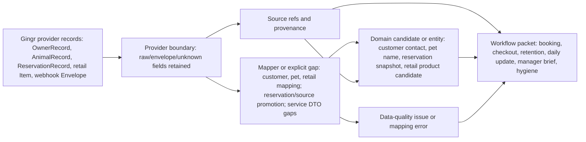
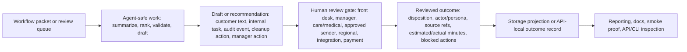

# Relationship adjacency and flow diagrams

This page turns the source/provider, workflow, storage, and runtime crosswalks into a single relationship map. It is written for operations and non-coder reviewers who need to see how a fact enters, becomes safe to use, gets reviewed, and is exposed or stored without confusing evidence with authority.

Use this page with:

- [Contract crosswalk schema and evidence rules](crosswalk-schema.md)
- [Gingr/source-provider normalization crosswalk](source-provider-flows.md)
- [Workflow packets contract crosswalk](workflow-packets.md)
- [Entity atlas storage and persistence crosswalk](storage-persistence.md)
- [Runtime exposure crosswalk](runtime-exposure.md)
- [Entity contract surface inventory](surface-inventory.md)
- [Entity atlas relationship map](../../design/entity-atlas-relationships.md)

Plain-English rule: a source fact can move through the system, but it does not become permission. Provider records, staff notes, documents, packets, drafts, outcomes, and runtime shells each have a narrower job. Human review is still required for customer messages, provider/PMS writes, schedule/capacity changes, money movement, safety/medical/behavior approvals, and source-data cleanup.

## Flow 1: enter -> normalize -> use -> persist -> expose

```mermaid
flowchart LR
    enter[Enter: Gingr endpoint or webhook, staff note, uploaded document, import, local fixture]
    normalize[Normalize: provenance, mapping candidate, domain entity, data-quality issue]
    use[Use: app workflow packet, review queue, agent prompt packet, draft, validation]
    persist[Persist: reviewed outcome, source ref, storage projection, audit or approval evidence]
    expose[Expose: API route, staff web shell, CLI JSON, worker posture, docs and Rustdoc]
    blocked[Blocked until reviewed: customer sends, provider/PMS writes, schedules, payments, safety decisions, source hiding]

    enter -->|source evidence only| normalize
    normalize -->|domain/app contract decides safe meaning| use
    use -->|human-reviewed disposition or local outcome capture| persist
    persist -->|read safely as proof, report, or inspection output| expose
    use -.->|draft/recommendation is not authority| blocked
    expose -.->|runtime shell is not business truth| blocked
```

Caption for operations readers: facts enter from providers, staff, documents, or fixtures; the repo first labels where they came from and what they can safely mean. Workflows may then organize, validate, rank, or draft around those facts. Only reviewed outcomes or projections become proof for reporting, and the API/worker/CLI/web shells expose that proof without granting live-action authority.

## Flow 2: provider evidence into source, domain, and review packets

Caption for operations readers: Gingr can say what it observed, but NVA decides what that observation means. If a provider field is incomplete, stale, sensitive, or unsupported, it becomes a mapping error or data-quality review item instead of quietly becoming operational truth.

## Flow 3: workflow packet into draft, review, outcome, and storage proof

Caption for operations readers: the agent sits before the reviewer, not after them. It can prepare the work and make blocked actions visible. The durable-looking evidence comes only after a human-reviewed disposition or validated outcome capture.

## Bidirectional adjacency table

Read the table both ways. The `Related entities` column names what each entity depends on and what it feeds. The `Contract / surface proof` column points to the current source, crosswalk, runtime, storage, or test surface that backs the relationship. When a relationship is only planned or fixture-local, the row says so.

| Entity | Related entities | Relationship direction and meaning | Contract / surface proof | Operations caption |
| --- | --- | --- | --- | --- |
| Gingr provider endpoint/request builder | Provider records, raw/envelope response, source provenance, mapping candidates, runtime bridge | Outbound: supplies read/request evidence and provider ids. Inbound: receives no local business authority from domain/app/storage. | [source-provider-flows.md](source-provider-flows.md); [runtime-exposure.md](runtime-exposure.md); `integrations/gingr/src/endpoint/*`; `integrations/gingr/src/response.rs`; `integrations/gingr/tests/endpoint_contracts.rs` | Gingr reads are receipts, not permission to write back or act. |
| Gingr webhook envelope / verified event | Provider event payload, signature key, source event evidence, future workflow event candidate | Outbound: can become verified source-event evidence after HMAC verification. Inbound: downstream workflow mapping is future/planned unless a workflow source/test names it. | [source-provider-flows.md](source-provider-flows.md); [runtime-exposure.md](runtime-exposure.md); `integrations/gingr/src/webhook.rs`; `integrations/gingr/tests/webhook_contracts.rs` | A verified webhook proves the message came through safely; it does not decide what the business should do. |
| Provider raw/envelope/DTO record | Gingr endpoint/webhook, unknown fields, mapper, source ref, data-quality issue | Outbound: preserves provider-shaped facts for mapping or quarantine. Inbound: mapper/domain contracts decide whether any field becomes a candidate. | [source-provider-flows.md](source-provider-flows.md); [surface-inventory.md](surface-inventory.md); `integrations/gingr/src/response.rs`; `integrations/gingr/src/dto/*.rs`; integration contract tests | Provider fields stay labeled as provider facts until promoted or rejected. |
| Customer contact candidate | Owner/provider record, domain customer/contact values, contact channel, CRM retention, booking triage, daily update, message draft, data-quality issue | Inbound: mapped from owner fields with validation. Outbound: feeds contact review, outreach drafts, missing-info work, retention eligibility, and customer-message gates. | [source-provider-flows.md](source-provider-flows.md); [workflow-packets.md](workflow-packets.md); `integrations/gingr/src/mapping/customer.rs`; `domain/src/customer.rs`; `domain/src/entities.rs`; `app/src/crm_retention.rs`; `app/src/daily_update.rs` | A contact candidate helps staff prepare outreach; it is not consent or a sent message. |
| Pet name/profile candidate | Animal/provider record, domain pet values, care profile, vaccine/document facts, daily update, booking triage, data-quality issue | Inbound: mapped from animal name/provider context. Outbound: helps build pet context for readiness, care messaging, hygiene review, and safety review. | [source-provider-flows.md](source-provider-flows.md); [storage-persistence.md](storage-persistence.md); `integrations/gingr/src/mapping/pet.rs`; `domain/src/pet.rs`; `domain/src/entities.rs`; `app/src/booking_triage.rs`; `app/src/daily_update.rs` | Pet facts are operationally useful only when source freshness and safety-sensitive review are visible. |
| Reservation source snapshot / reservation status | Gingr reservation record, provenance, customer, pet, location, service, booking triage, checkout completion, manager brief, retention | Inbound: provider ids/status become source snapshot evidence with assumptions. Outbound: feeds readiness, checkout exception, retention eligibility, and daily manager risk queues. | [source-provider-flows.md](source-provider-flows.md); [workflow-packets.md](workflow-packets.md); `domain/src/source.rs`; `domain/src/reservation/mod.rs`; `app/src/booking_triage.rs`; `app/src/checkout_completion.rs`; `app/tests/checkout_completion_workflow_contracts.rs` | Reservation status can be observed or suggested, but check-in/out and confirmation still need approved system-of-record action. |
| Provenance / source record reference | Source system, endpoint, record id, payload hash/ref, workflow packets, storage refs, data-quality issues, outcomes | Inbound: attached by provider/import/staff/document evidence. Outbound: anchors every review packet and stored outcome to the evidence it used. | [crosswalk-schema.md](crosswalk-schema.md); [source-provider-flows.md](source-provider-flows.md); [storage-persistence.md](storage-persistence.md); `domain/src/source.rs`; `storage/src/operations.rs`; app workflow tests | Provenance is the receipt; it proves traceability, not truth, freshness, or approval. |
| Data-quality issue | Provenance, mapping error, field path, freshness/sensitivity, hygiene candidate/action, manager/regional risk, outcome record | Inbound: created from missing, stale, ambiguous, conflicting, sensitive, or invalid source facts. Outbound: blocks unsafe workflow use, feeds cleanup queues, and can be measured after review. | [workflow-packets.md](workflow-packets.md); [storage-persistence.md](storage-persistence.md); `domain/src/data_quality.rs`; `app/src/data_quality_hygiene.rs`; `storage/src/operations.rs`; `app/tests/data_quality_hygiene_workflow_contracts.rs` | A data-quality issue is a safety light: it tells staff what needs review before automation relies on it. |
| Retail product candidate | Gingr retail item, mapping error, retail domain contract, inventory/POS/vendor/reorder concepts, manager brief, hygiene review | Inbound: mapped from provider item/SKU/category fields. Outbound: can feed internal product or reorder review; no direct POS/inventory/vendor action. | [source-provider-flows.md](source-provider-flows.md); [storage-persistence.md](storage-persistence.md); `integrations/gingr/src/dto/retail.rs`; `integrations/gingr/src/mapping/retail.rs`; `domain/src/retail/mod.rs` | A product candidate is a review prompt, not approved inventory or a vendor order. |
| Grooming/training provider surface gap | Gingr service endpoint names, provider-surface gap marker, domain grooming/training contracts, retention or training opportunities | Inbound: endpoint/catalog names exist without stable service DTO mapping. Outbound: only a documented gap until a mapper/test exists. | [source-provider-flows.md](source-provider-flows.md); `integrations/gingr/src/dto/grooming.rs`; `integrations/gingr/src/dto/training.rs`; `integrations/gingr/tests/expanded_endpoint_contracts.rs`; `domain/src/grooming/mod.rs`; `domain/src/training/mod.rs` | The docs intentionally say “we do not know this provider shape yet” so readers do not invent service facts. |
| Booking triage packet | Reservation, customer, pet, vaccine/document evidence, care/behavior/payment/deposit hard stops, review gates, audit draft | Inbound: reads source-backed readiness facts and policy context. Outbound: produces deterministic readiness, staff evaluation packet, confirmation/missing-info draft, blocked actions. | [workflow-packets.md](workflow-packets.md); [storage-persistence.md](storage-persistence.md); `app/src/booking_triage.rs`; `app/tests/booking_triage_mvp.rs`; `app/tests/workflow_service_composition_contracts.rs` | Booking triage reduces readiness checking; it cannot confirm, reject, waitlist-release, or move money by itself. |
| Checkout completion packet | Reservation source status, staff handoff, care summary, belongings/payment/care exceptions, retention packet, manager brief | Inbound: reads checkout/source and staff handoff evidence. Outbound: suggests reviewable completion status, audit drafts, handoff tasks, and retention follow-up only when staff-verified. | [workflow-packets.md](workflow-packets.md); `app/src/checkout_completion.rs`; `app/tests/checkout_completion_workflow_contracts.rs`; `integrations/gingr/src/endpoint/reservations.rs` | Checkout automation prepares the closeout checklist; it does not check a pet out or alter provider status. |
| CRM retention / grooming rebooking packet | Checkout proof, customer contact permission, grooming history/cadence, retention opportunity, message draft, outcome record | Inbound: requires staff-verified checkout plus consent/contact evidence. Outbound: produces review queue and follow-up draft/outcome. | [workflow-packets.md](workflow-packets.md); [storage-persistence.md](storage-persistence.md); `app/src/crm_retention.rs`; `domain/src/grooming/mod.rs`; `domain/src/message.rs`; `app/tests/crm_retention_workflow_contracts.rs` | Retention can draft a rebooking nudge; staff still controls whether to send, book, discount, or suppress. |
| Daily update / Pawgress draft packet | Staff care notes, pet/customer context, message draft, omitted/included facts, review disposition, send stub | Inbound: reads staff care notes and policy/redaction context. Outbound: customer-safe draft, internal flags, blocked send stub, approval/review evidence. | [workflow-packets.md](workflow-packets.md); `app/src/daily_update.rs`; `domain/src/message.rs`; `domain/src/workflow.rs`; `app/tests/daily_care_update_mvp.rs` | Pawgress drafts save writing time but remain blocked customer messages until an approved sender reviews them. |
| Manager daily brief packet | Location/day, service demand, checkout exceptions, retention opportunities, data-quality issues, labor facts, outcome records | Inbound: aggregates workflow/source/operations evidence. Outbound: ranks manager actions, drafts internal/customer-message review items, and captures reviewed outcome feedback. | [workflow-packets.md](workflow-packets.md); [runtime-exposure.md](runtime-exposure.md); `app/src/manager_daily_brief.rs`; `storage/src/operations.rs`; `apps/api/tests/manager_daily_brief_agent_context_contract.rs` | The brief is the manager’s queue, not the manager. It helps choose work and measure time saved after review. |
| Data-quality hygiene packet | Data-quality issue, source refs, sensitivity/freshness, candidate/action, draft validation, outcome record | Inbound: groups source problems into cleanup work. Outbound: ranks internal tasks, validates draft cleanup submissions, records reviewed cleanup outcome. | [workflow-packets.md](workflow-packets.md); [runtime-exposure.md](runtime-exposure.md); `app/src/data_quality_hygiene.rs`; `storage/src/operations.rs`; `apps/api/tests/data_quality_hygiene_agent_contract.rs` | Hygiene work fixes confidence first; it does not secretly edit or hide source records. |
| Regional labor exceptions / portfolio view | Manager daily brief outcomes, data-quality outcomes, operations/labor metrics, location/period group, regional review | Inbound: planned aggregation over reviewed local outcomes and operations context. Outbound: future exception queue or GM follow-up draft. | [workflow-packets.md](workflow-packets.md); [storage-persistence.md](storage-persistence.md); `domain/src/operations.rs`; `domain/src/analytics.rs`; `storage/src/operations.rs`; `integrations/gingr/src/endpoint/labor_ops.rs` | Regional rollups are currently reporting/planned; they do not schedule staff or change payroll. |
| Review gate / blocked action | Workflow packet, draft, human role, approval record, audit event, outcome record | Inbound: named by policy/workflow when a fact touches customer, provider, schedule, money, safety, privacy, or ambiguity. Outbound: sends work to the correct reviewer and keeps blocked actions visible. | [workflow-packets.md](workflow-packets.md); [runtime-exposure.md](runtime-exposure.md); `domain/src/policy.rs`; `domain/src/workflow.rs`; API draft validation tests | A review gate is the handoff to a person with authority; it is not paperwork to be skipped by an agent. |
| Approval record / audit event | Reviewer, workflow packet, message/document/vaccine/action decision, source refs, outcome record, API local state | Inbound: created when a human/system review decision is recorded. Outbound: provides traceability for why a draft, eligibility status, or outcome changed. | [storage-persistence.md](storage-persistence.md); [runtime-exposure.md](runtime-exposure.md); `domain/src/entities.rs`; `domain/src/audit.rs`; `apps/api/src/http.rs`; API vaccine/document tests | Approval and audit evidence are currently local/runtime-contract evidence unless a durable store is added. |
| Manager daily brief outcome record | Manager action, source refs, actor/persona, feedback outcome, estimated/actual labor minutes, reporting group, API outcome route | Inbound: reviewed manager disposition. Outbound: storage-shaped proof for reporting, labor measurement, and future regional rollups. | [storage-persistence.md](storage-persistence.md); [runtime-exposure.md](runtime-exposure.md); `storage/src/operations.rs`; `apps/api/src/http.rs`; `storage/tests/manager_daily_brief_outcome_storage.rs` | This is where “could save time” starts becoming measured local proof. |
| Data-quality hygiene outcome record | Hygiene action, issue refs, source refs, resolution status, actor/persona, actual minutes, reporting group, API outcome route | Inbound: reviewed cleanup disposition. Outbound: storage-shaped proof that a cleanup item was reviewed and measured. | [storage-persistence.md](storage-persistence.md); [runtime-exposure.md](runtime-exposure.md); `storage/src/operations.rs`; `apps/api/src/http.rs`; `storage/tests/data_quality_hygiene_outcome_storage.rs` | The record captures what staff did about a source issue; it does not repair the source by itself. |
| Storage operations and service-line records | Domain service-line contracts, source refs, manager/data-quality outcomes, portfolio/technology/context records, API local state | Inbound: receives app/domain/storage projections. Outbound: JSON/projection proof and reporting group calculations. | [storage-persistence.md](storage-persistence.md); [surface-inventory.md](surface-inventory.md); `storage/src/operations.rs`; `storage/src/service_line/*.rs`; storage tests | Storage is proof and projection; it is not a decision maker or live provider writer. |
| API HTTP route and in-memory state | Workflow packets, draft validation, reviewed outcomes, vaccine/document/inquiry records, audit events, storage-shaped records | Inbound: route JSON calls app/domain/storage contracts. Outbound: local response DTOs, outcome capture, review queues, health/readiness posture. | [runtime-exposure.md](runtime-exposure.md); [storage-persistence.md](storage-persistence.md); `apps/api/src/http.rs`; `apps/api/tests/*`; `apps/api/README.md` | The API shell is useful for local contract proof, but current state is process-local/demo unless future persistence is wired. |
| Worker runtime shell | Runtime config, fake/disabled agent mode, stubbed side-effect posture, future job queue | Inbound: reads environment/config posture. Outbound: logs safe runtime state; no queue or live workflow processing proven today. | [runtime-exposure.md](runtime-exposure.md); `apps/worker/src/runtime.rs`; `apps/worker/src/main.rs`; `apps/worker/tests/runtime_mode_contract.rs` | The worker exists as a safety shell, not as a live autonomous jobs engine. |
| CLI inspection shell | Agent specs, tool candidates, app/domain contracts, runtime/docs readers | Inbound: reads source-controlled app agent/tool definitions. Outbound: read-only JSON for humans or docs. | [runtime-exposure.md](runtime-exposure.md); `apps/cli/src/main.rs`; `apps/cli/README.md`; `app/src/agents.rs`; `app/src/tools.rs` | The `pet-resort` CLI inspects boundaries; it does not start an agent or call providers. |
| Staff web shell | Demo dashboard data, local review gates, document/vaccine workflow, manager/action concepts, audit-visible actions | Inbound: currently hard-coded/static local MVP data. Outbound: human-facing UI proof of review-gate concepts. | [runtime-exposure.md](runtime-exposure.md); `apps/staff-web/app/page.tsx`; `apps/staff-web/smoke/staff-dashboard-mvp.test.mjs` | The dashboard shows how work should look to staff; it is not currently the source of truth. |
| Smoke/bridge scripts | Local API route, manager/data-quality context, drafts, blocked drafts, reviewed outcomes, OpenViking/status artifacts | Inbound: call local API or fixture examples. Outbound: JSON artifacts and contract proof. | [runtime-exposure.md](runtime-exposure.md); `scripts/hermes-tools/*`; `scripts/smoke_manager_daily_brief_local_loop.sh`; `scripts/smoke_data_quality_hygiene_local_loop.sh`; `scripts/tests/test_hermes_agent_bridge.py` | Passing smoke proves a local fail-closed path, not production automation. |

## Edge families by direction

| Start here | Follow to | What the edge means | Proof to cite |
| --- | --- | --- | --- |
| Source/provider evidence | Provenance and provider records | Evidence has arrived and is labeled with origin. | [source-provider-flows.md](source-provider-flows.md), `domain/src/source.rs`, `integrations/gingr/src/*` |
| Provenance and provider records | Domain candidate or data-quality issue | A mapper/source contract either promotes, qualifies, or rejects unsafe facts. | `integrations/gingr/src/mapping/*`, `domain/src/data_quality.rs`, `domain/src/entities.rs` |
| Domain candidate/entity | Workflow packet | The app can use normalized facts in a review bundle. | [workflow-packets.md](workflow-packets.md), `app/src/*` workflow modules |
| Workflow packet | Draft/recommendation/blocked action | The agent or app may prepare work, but blocked actions stay named. | `app/src/agents.rs`, `domain/src/workflow.rs`, API draft validation tests |
| Draft/recommendation | Human review gate | The right human role owns the live action or sensitive decision. | `domain/src/policy.rs`, workflow packet rows, API validation tests |
| Human-reviewed disposition | Outcome/audit/approval record | Reviewed work can be measured or traced. | `domain/src/audit.rs`, `apps/api/src/http.rs`, `storage/src/operations.rs` |
| Outcome/source refs | Storage projection/reporting proof | Reviewed evidence becomes a storage-shaped record or reporting input. | [storage-persistence.md](storage-persistence.md), storage tests |
| Storage/app contracts | API/worker/CLI/web/docs | Runtime shells expose or inspect the contract safely. | [runtime-exposure.md](runtime-exposure.md), `apps/api`, `apps/worker`, `apps/cli`, `apps/staff-web` |

## Operational reading checklist

Use these questions when a future entity page, workflow page, or diagram cites this adjacency map:

1. Can the reader tell whether a thing is provider evidence, domain meaning, workflow review state, storage proof, or runtime exposure?
2. Does every provider/source edge preserve provenance or a data-quality/mapping-error path?
3. Does every workflow edge say what automation may do in narrow verbs: read, map, validate, summarize, rank, draft, prepare internal task, or record reviewed outcome?
4. Does every sensitive edge name the blocked or human-reviewed actions in plain English?
5. Does every labor, revenue, or quality claim point to outcome fields, reviewed disposition, actual/estimated minutes, or planned-metric wording?
6. Does every API/worker/CLI/web edge avoid implying production persistence or live side effects unless the source/test proves them?

## Known caveats to preserve

- Gingr service DTOs for grooming/training are explicit provider-surface gaps; do not invent service-name, duration, price, cadence, package, or trainer mappings from endpoint names alone.
- Verified webhooks are parser/verification evidence only in this repo slice; there is no live webhook receiver route or durable idempotent event store wired here.
- Booking triage, checkout completion, CRM retention, and daily update workflows have app/test evidence but not dedicated durable outcome storage like manager daily brief and data-quality hygiene.
- API route state is process-local/demo contract state. Storage record shapes exist, but a production database/outbox/object store adapter is not proven by the current runtime shell.
- Worker and CLI surfaces expose runtime posture or inspection JSON. They are not live schedulers, provider import/export commands, or autonomous side-effect engines.
- Staff web is a static/local MVP shell. It demonstrates review concepts; it is not an API-backed source of truth today.
